# [📈 Live Status](https://status.mask.io): <!--live status--> **🟧 Partial outage**

This repository contains the open-source uptime monitor and status page for [Dimension](https://dimension.im), powered by [Upptime](https://github.com/upptime/upptime).

With [Upptime](https://upptime.js.org), you can get your own unlimited and free uptime monitor and status page, powered entirely by a GitHub repository. We use [Issues](https://github.com/DimensionDev/status/issues) as incident reports, [Actions](https://github.com/DimensionDev/status/actions) as uptime monitors, and [Pages](https://status.mask.io) for the status page.

<!--start: status pages-->
<!-- This summary is generated by Upptime (https://github.com/upptime/upptime) -->
<!-- Do not edit this manually, your changes will be overwritten -->
<!-- prettier-ignore -->
| URL | Status | History | Response Time | Uptime |
| --- | ------ | ------- | ------------- | ------ |
|  [mask.io](https://mask.io) | 🟩 Up | [mask-io.yml](https://github.com/DimensionDev/status/commits/HEAD/history/mask-io.yml) | 

 439ms
     
 | 

<a href="https://status.mask.io/history/mask-io">100.00%</a>
    

|  [Maskbook UnlockProtocol plugin server](https://unlock.r2d2.to) | 🟥 Down | [maskbook-unlock-protocol-plugin-server.yml](https://github.com/DimensionDev/status/commits/HEAD/history/maskbook-unlock-protocol-plugin-server.yml) | 

 19652ms
     
 | 

<a href="https://status.mask.io/history/maskbook-unlock-protocol-plugin-server">0.00%</a>
    

|  [mastodon.cloud](https://mastodon.cloud/health) | 🟩 Up | [mastodon-cloud.yml](https://github.com/DimensionDev/status/commits/HEAD/history/mastodon-cloud.yml) | 

 305ms
     
 | 

<a href="https://status.mask.io/history/mastodon-cloud">100.00%</a>
    

|  [mstdn.jp](https://mstdn.jp/health) | 🟩 Up | [mstdn-jp.yml](https://github.com/DimensionDev/status/commits/HEAD/history/mstdn-jp.yml) | 

 399ms
     
 | 

<a href="https://status.mask.io/history/mstdn-jp">99.79%</a>
    

|  RPC server - Infura Mainnet | 🟩 Up | [rpc-server-infura-mainnet.yml](https://github.com/DimensionDev/status/commits/HEAD/history/rpc-server-infura-mainnet.yml) | 

 323ms
     
 | 

<a href="https://status.mask.io/history/rpc-server-infura-mainnet">100.00%</a>
    

|  RPC server - Quiknode Mainnet | 🟨 Degraded | [rpc-server-quiknode-mainnet.yml](https://github.com/DimensionDev/status/commits/HEAD/history/rpc-server-quiknode-mainnet.yml) | 

 317ms
     
 | 

<a href="https://status.mask.io/history/rpc-server-quiknode-mainnet">0.00%</a>
    

|  RPC server - Binance BSC | 🟩 Up | [rpc-server-binance-bsc.yml](https://github.com/DimensionDev/status/commits/HEAD/history/rpc-server-binance-bsc.yml) | 

 278ms
     
 | 

<a href="https://status.mask.io/history/rpc-server-binance-bsc">100.00%</a>
    

|  RPC server - Infura Matic Mainnet | 🟩 Up | [rpc-server-infura-matic-mainnet.yml](https://github.com/DimensionDev/status/commits/HEAD/history/rpc-server-infura-matic-mainnet.yml) | 

 408ms
     
 | 

<a href="https://status.mask.io/history/rpc-server-infura-matic-mainnet">98.75%</a>
    

|  RPC server - Arbitrum | 🟩 Up | [rpc-server-arbitrum.yml](https://github.com/DimensionDev/status/commits/HEAD/history/rpc-server-arbitrum.yml) | 

 302ms
     
 | 

<a href="https://status.mask.io/history/rpc-server-arbitrum">100.00%</a>
    

|  RPC server - xDai | 🟩 Up | [rpc-server-x-dai.yml](https://github.com/DimensionDev/status/commits/HEAD/history/rpc-server-x-dai.yml) | 

 347ms
     
 | 

<a href="https://status.mask.io/history/rpc-server-x-dai">100.00%</a>
    

|  RPC server - Avalanche | 🟩 Up | [rpc-server-avalanche.yml](https://github.com/DimensionDev/status/commits/HEAD/history/rpc-server-avalanche.yml) | 

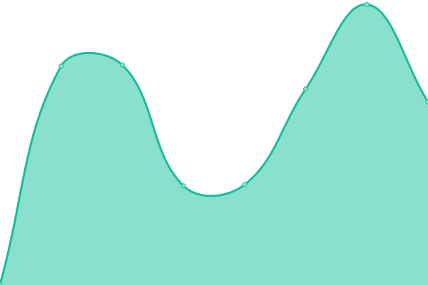 300ms
     
 | 

<a href="https://status.mask.io/history/rpc-server-avalanche">100.00%</a>
    

|  RPC server - Celo | 🟩 Up | [rpc-server-celo.yml](https://github.com/DimensionDev/status/commits/HEAD/history/rpc-server-celo.yml) | 

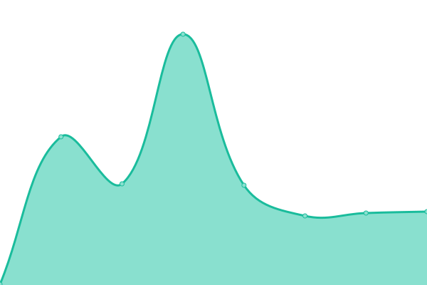 185ms
     
 | 

<a href="https://status.mask.io/history/rpc-server-celo">100.00%</a>
    

|  RPC server - Fantom | 🟥 Down | [rpc-server-fantom.yml](https://github.com/DimensionDev/status/commits/HEAD/history/rpc-server-fantom.yml) | 

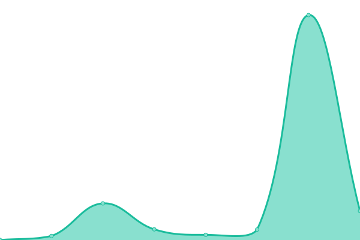 144ms
     
 | 

<a href="https://status.mask.io/history/rpc-server-fantom">0.00%</a>
    

|  RPC server - Aurora | 🟨 Degraded | [rpc-server-aurora.yml](https://github.com/DimensionDev/status/commits/HEAD/history/rpc-server-aurora.yml) | 

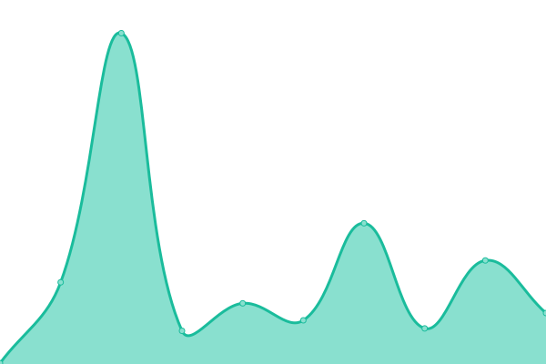 0ms
     
 | 

<a href="https://status.mask.io/history/rpc-server-aurora">0.00%</a>
    

|  RPC server - Conflux | 🟩 Up | [rpc-server-conflux.yml](https://github.com/DimensionDev/status/commits/HEAD/history/rpc-server-conflux.yml) | 

 1056ms
     
 | 

<a href="https://status.mask.io/history/rpc-server-conflux">100.00%</a>
    

|  RPC server - Harmony | 🟩 Up | [rpc-server-harmony.yml](https://github.com/DimensionDev/status/commits/HEAD/history/rpc-server-harmony.yml) | 

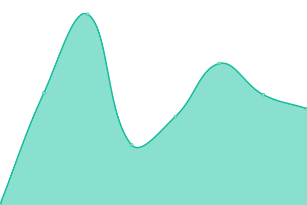 285ms
     
 | 

<a href="https://status.mask.io/history/rpc-server-harmony">100.00%</a>
    

|  RPC server - Astar | 🟩 Up | [rpc-server-astar.yml](https://github.com/DimensionDev/status/commits/HEAD/history/rpc-server-astar.yml) | 

 226ms
     
 | 

<a href="https://status.mask.io/history/rpc-server-astar">99.82%</a>
    

|  RPC server - Optimism | 🟩 Up | [rpc-server-optimism.yml](https://github.com/DimensionDev/status/commits/HEAD/history/rpc-server-optimism.yml) | 

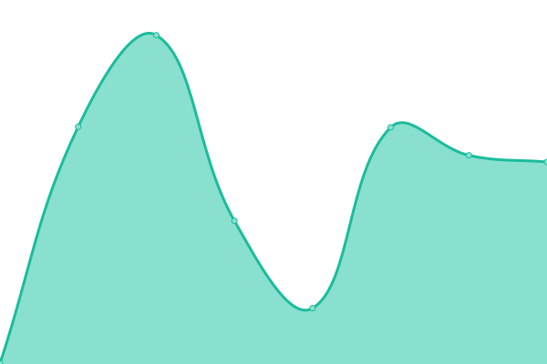 333ms
     
 | 

<a href="https://status.mask.io/history/rpc-server-optimism">99.78%</a>
    

|  API - Rabby Token | 🟩 Up | [api-rabby-token.yml](https://github.com/DimensionDev/status/commits/HEAD/history/api-rabby-token.yml) | 

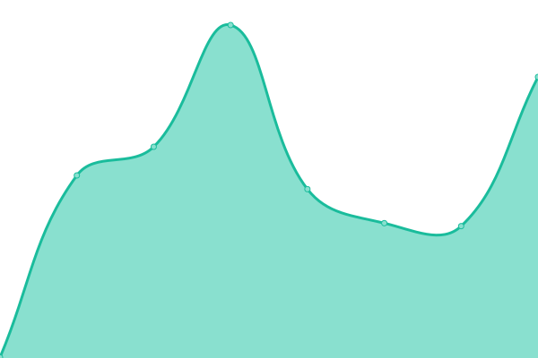 853ms
     
 | 

<a href="https://status.mask.io/history/api-rabby-token">100.00%</a>
    

|  API - Astar Gas Price | 🟩 Up | [api-astar-gas-price.yml](https://github.com/DimensionDev/status/commits/HEAD/history/api-astar-gas-price.yml) | 

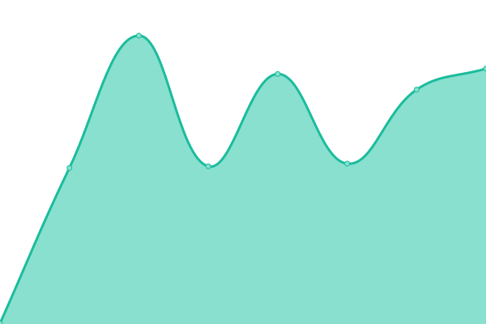 419ms
     
 | 

<a href="https://status.mask.io/history/api-astar-gas-price">98.35%</a>
    

|  API - Chainbase NFT | 🟩 Up | [api-chainbase-nft.yml](https://github.com/DimensionDev/status/commits/HEAD/history/api-chainbase-nft.yml) | 

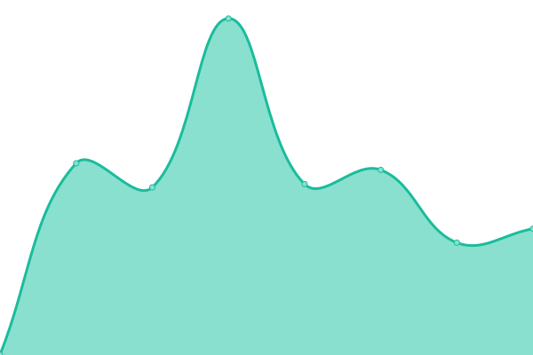 779ms
     
 | 

<a href="https://status.mask.io/history/api-chainbase-nft">100.00%</a>
    

|  API - CoinMarketCap Trending Widget | 🟩 Up | [api-coin-market-cap-trending-widget.yml](https://github.com/DimensionDev/status/commits/HEAD/history/api-coin-market-cap-trending-widget.yml) | 

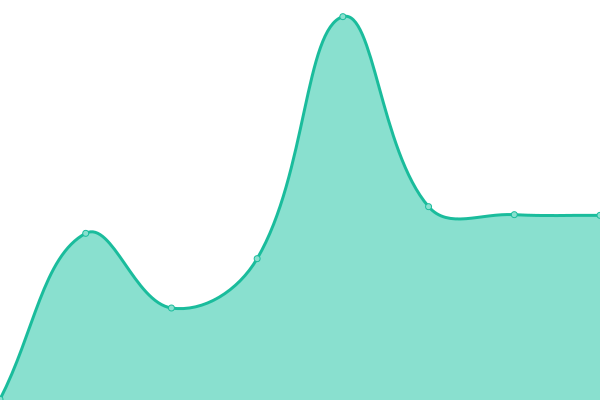 251ms
     
 | 

<a href="https://status.mask.io/history/api-coin-market-cap-trending-widget">100.00%</a>
    

|  API - CoinMarketCap Trending | 🟥 Down | [api-coin-market-cap-trending.yml](https://github.com/DimensionDev/status/commits/HEAD/history/api-coin-market-cap-trending.yml) | 

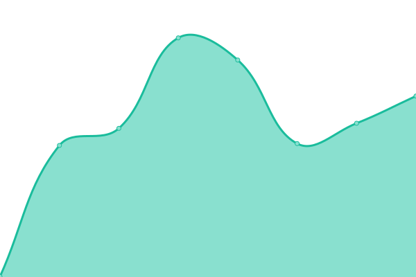 386ms
     
 | 

<a href="https://status.mask.io/history/api-coin-market-cap-trending">0.00%</a>
    

|  API - CoinGecko Trending | 🟩 Up | [api-coin-gecko-trending.yml](https://github.com/DimensionDev/status/commits/HEAD/history/api-coin-gecko-trending.yml) | 

 259ms
     
 | 

<a href="https://status.mask.io/history/api-coin-gecko-trending">100.00%</a>
    

|  API - Debank Gas Price Dict | 🟥 Down | [api-debank-gas-price-dict.yml](https://github.com/DimensionDev/status/commits/HEAD/history/api-debank-gas-price-dict.yml) | 

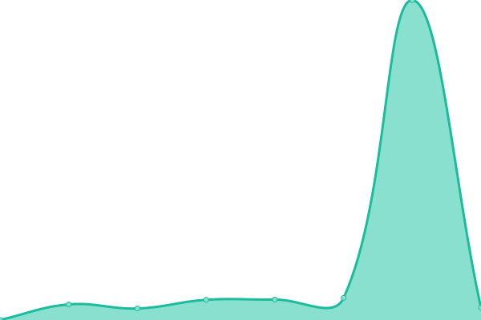 270ms
     
 | 

<a href="https://status.mask.io/history/api-debank-gas-price-dict">0.00%</a>
    

|  API - Debank NFT | 🟩 Up | [api-debank-nft.yml](https://github.com/DimensionDev/status/commits/HEAD/history/api-debank-nft.yml) | 

 1389ms
     
 | 

<a href="https://status.mask.io/history/api-debank-nft">100.00%</a>
    

|  API - Gem NFT | 🟥 Down | [api-gem-nft.yml](https://github.com/DimensionDev/status/commits/HEAD/history/api-gem-nft.yml) | 

 19576ms
     
 | 

<a href="https://status.mask.io/history/api-gem-nft">0.00%</a>
    

|  API - Looksrare NFT | 🟥 Down | [api-looksrare-nft.yml](https://github.com/DimensionDev/status/commits/HEAD/history/api-looksrare-nft.yml) | 

 325ms
     
 | 

<a href="https://status.mask.io/history/api-looksrare-nft">0.00%</a>
    

|  API - Metaswap Gas Price | 🟩 Up | [api-metaswap-gas-price.yml](https://github.com/DimensionDev/status/commits/HEAD/history/api-metaswap-gas-price.yml) | 

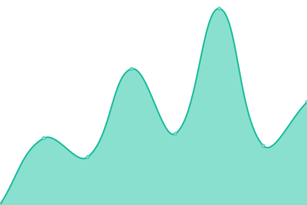 288ms
     
 | 

<a href="https://status.mask.io/history/api-metaswap-gas-price">100.00%</a>
    

|  API - Minds SNS | 🟩 Up | [api-minds-sns.yml](https://github.com/DimensionDev/status/commits/HEAD/history/api-minds-sns.yml) | 

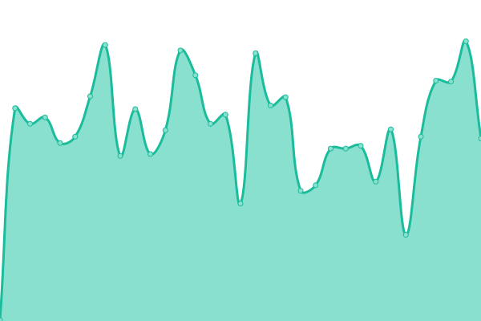 270ms
     
 | 

<a href="https://status.mask.io/history/api-minds-sns">100.00%</a>
    

|  API - NFTScan EVM NFT | 🟩 Up | [api-nft-scan-evm-nft.yml](https://github.com/DimensionDev/status/commits/HEAD/history/api-nft-scan-evm-nft.yml) | 

 2515ms
     
 | 

<a href="https://status.mask.io/history/api-nft-scan-evm-nft">100.00%</a>
    

|  API - NFTScan Solana NFT | 🟩 Up | [api-nft-scan-solana-nft.yml](https://github.com/DimensionDev/status/commits/HEAD/history/api-nft-scan-solana-nft.yml) | 

 2688ms
     
 | 

<a href="https://status.mask.io/history/api-nft-scan-solana-nft">0.00%</a>
    

|  API - NFTScan Trending | 🟩 Up | [api-nft-scan-trending.yml](https://github.com/DimensionDev/status/commits/HEAD/history/api-nft-scan-trending.yml) | 

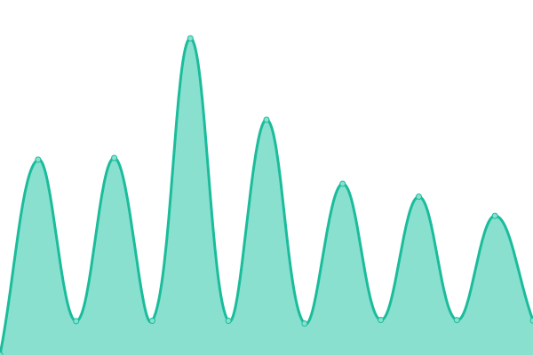 1153ms
     
 | 

<a href="https://status.mask.io/history/api-nft-scan-trending">100.00%</a>
    

|  API - NFTScan Trending | 🟩 Up | [api-nft-scan-trending.yml](https://github.com/DimensionDev/status/commits/HEAD/history/api-nft-scan-trending.yml) | 

 1153ms
     
 | 

<a href="https://status.mask.io/history/api-nft-scan-trending">100.00%</a>
    

|  API - Rabby NFT | 🟩 Up | [api-rabby-nft.yml](https://github.com/DimensionDev/status/commits/HEAD/history/api-rabby-nft.yml) | 

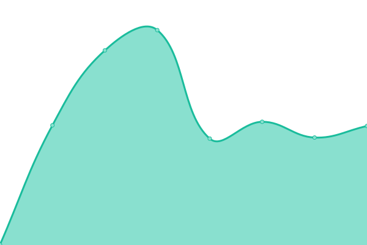 397ms
     
 | 

<a href="https://status.mask.io/history/api-rabby-nft">100.00%</a>
    

|  API - X2Y2 NFT | 🟥 Down | [api-x2-y2-nft.yml](https://github.com/DimensionDev/status/commits/HEAD/history/api-x2-y2-nft.yml) | 

 19513ms
     
 | 

<a href="https://status.mask.io/history/api-x2-y2-nft">0.00%</a>
    

|  API - Zora NFT | 🟥 Down | [api-zora-nft.yml](https://github.com/DimensionDev/status/commits/HEAD/history/api-zora-nft.yml) | 

 447ms
     
 | 

<a href="https://status.mask.io/history/api-zora-nft">0.00%</a>
    

|  API - Twitter Identity | 🟥 Down | [api-twitter-identity.yml](https://github.com/DimensionDev/status/commits/HEAD/history/api-twitter-identity.yml) | 

 1124ms
     
 | 

<a href="https://status.mask.io/history/api-twitter-identity">0.00%</a>
    

|  API - Lens | 🟨 Degraded | [api-lens.yml](https://github.com/DimensionDev/status/commits/HEAD/history/api-lens.yml) | 

 304ms
     
 | 

<a href="https://status.mask.io/history/api-lens">0.00%</a>
    

|  API - RSS3 Domain | 🟥 Down | [api-rss-3-domain.yml](https://github.com/DimensionDev/status/commits/HEAD/history/api-rss-3-domain.yml) | 

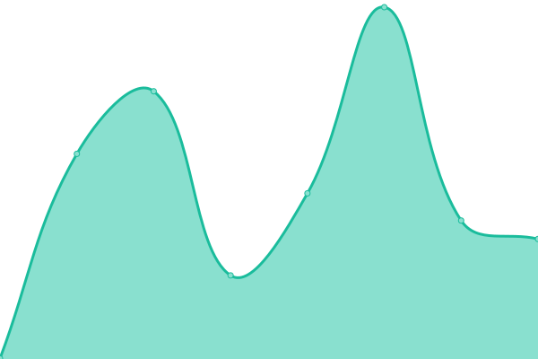 0ms
     
 | 

<a href="https://status.mask.io/history/api-rss-3-domain">0.00%</a>
    

|  API - Relation Service | 🟨 Degraded | [api-relation-service.yml](https://github.com/DimensionDev/status/commits/HEAD/history/api-relation-service.yml) | 

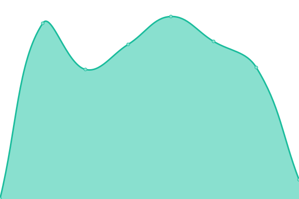 1004ms
     
 | 

<a href="https://status.mask.io/history/api-relation-service">0.00%</a>
    

|  API - Simple Hash | 🟥 Down | [api-simple-hash.yml](https://github.com/DimensionDev/status/commits/HEAD/history/api-simple-hash.yml) | 

 19555ms
     
 | 

<a href="https://status.mask.io/history/api-simple-hash">0.00%</a>
    

|  API - Twitter Handler Verify | 🟥 Down | [api-twitter-handler-verify.yml](https://github.com/DimensionDev/status/commits/HEAD/history/api-twitter-handler-verify.yml) | 

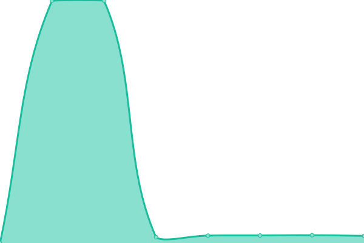 412ms
     
 | 

<a href="https://status.mask.io/history/api-twitter-handler-verify">0.00%</a>
    

|  Assets - Cloudflare Images | 🟩 Up | [assets-cloudflare-images.yml](https://github.com/DimensionDev/status/commits/HEAD/history/assets-cloudflare-images.yml) | 

 124ms
     
 | 

<a href="https://status.mask.io/history/assets-cloudflare-images">100.00%</a>
    

|  [Maskbook File Service Recovery](https://mask-fileservice-landingpage.pages.dev/recover) | 🟩 Up | [maskbook-file-service-recovery.yml](https://github.com/DimensionDev/status/commits/HEAD/history/maskbook-file-service-recovery.yml) | 

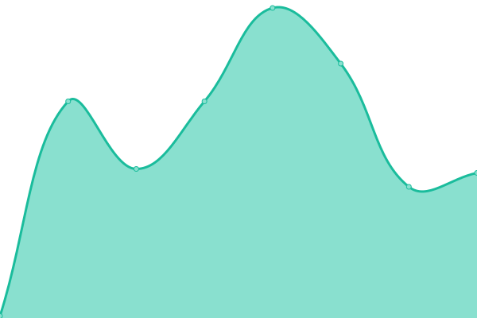 161ms
     
 | 

<a href="https://status.mask.io/history/maskbook-file-service-recovery">100.00%</a>
    

|  [Arweave](https://2uhlk62ro3ctby7mehzurppjwc7tjuezhzthbjabmm2v6jtrnsba.arweave.net/1Q61e1F2xTDj7CHzSL3psL800Jk-ZnCkAWM1XyZxbII#uxKdi0MDuxp7huif) | 🟩 Up | [arweave.yml](https://github.com/DimensionDev/status/commits/HEAD/history/arweave.yml) | 

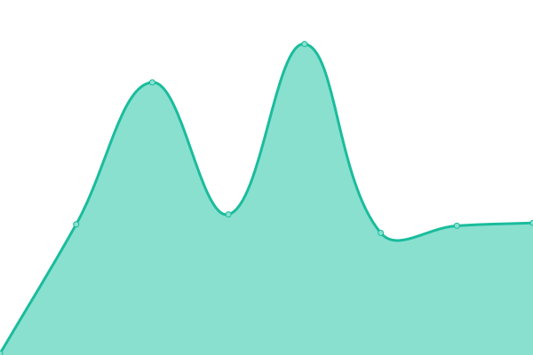 175ms
     
 | 

<a href="https://status.mask.io/history/arweave">100.00%</a>
    

<!--end: status pages-->

[**Visit our status website →**](https://status.mask.io)

## 📄 License

- Powered by: [Upptime](https://github.com/upptime/upptime)
- Code: [MIT](./LICENSE) © [Dimension](https://dimension.im)
- Data in the `./history` directory: [Open Database License](https://opendatacommons.org/licenses/odbl/1-0/)
