# [📈 Live Status](https://status.mask.io): <!--live status--> **🟨 Degraded performance**

This repository contains the open-source uptime monitor and status page for [Dimension](https://dimension.im), powered by [Upptime](https://github.com/upptime/upptime).

With [Upptime](https://upptime.js.org), you can get your own unlimited and free uptime monitor and status page, powered entirely by a GitHub repository. We use [Issues](https://github.com/DimensionDev/status/issues) as incident reports, [Actions](https://github.com/DimensionDev/status/actions) as uptime monitors, and [Pages](https://status.mask.io) for the status page.

<!--start: status pages-->
<!-- This summary is generated by Upptime (https://github.com/upptime/upptime) -->
<!-- Do not edit this manually, your changes will be overwritten -->
<!-- prettier-ignore -->
| URL | Status | History | Response Time | Uptime |
| --- | ------ | ------- | ------------- | ------ |
|  [mask.io](https://mask.io) | 🟩 Up | [mask-io.yml](https://github.com/DimensionDev/status.mask.io/commits/HEAD/history/mask-io.yml) | 

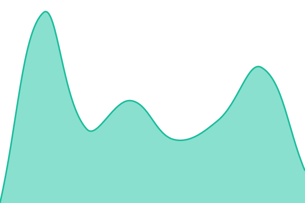 566ms
     
 | 

<a href="https://status.mask.io/history/mask-io">100.00%</a>
    

|  RPC server - Infura Mainnet | 🟨 Degraded | [rpc-server-infura-mainnet.yml](https://github.com/DimensionDev/status.mask.io/commits/HEAD/history/rpc-server-infura-mainnet.yml) | 

 190ms
     
 | 

<a href="https://status.mask.io/history/rpc-server-infura-mainnet">0.00%</a>
    

|  RPC server - Binance BSC | 🟩 Up | [rpc-server-binance-bsc.yml](https://github.com/DimensionDev/status.mask.io/commits/HEAD/history/rpc-server-binance-bsc.yml) | 

 306ms
     
 | 

<a href="https://status.mask.io/history/rpc-server-binance-bsc">100.00%</a>
    

|  RPC server - Infura Matic Mainnet | 🟨 Degraded | [rpc-server-infura-matic-mainnet.yml](https://github.com/DimensionDev/status.mask.io/commits/HEAD/history/rpc-server-infura-matic-mainnet.yml) | 

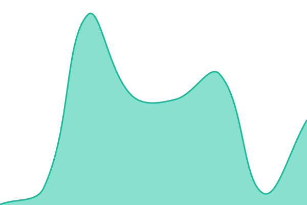 140ms
     
 | 

<a href="https://status.mask.io/history/rpc-server-infura-matic-mainnet">0.00%</a>
    

|  RPC server - Arbitrum | 🟨 Degraded | [rpc-server-arbitrum.yml](https://github.com/DimensionDev/status.mask.io/commits/HEAD/history/rpc-server-arbitrum.yml) | 

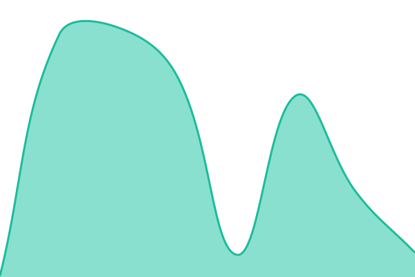 130ms
     
 | 

<a href="https://status.mask.io/history/rpc-server-arbitrum">0.00%</a>
    

|  RPC server - xDai | 🟩 Up | [rpc-server-x-dai.yml](https://github.com/DimensionDev/status.mask.io/commits/HEAD/history/rpc-server-x-dai.yml) | 

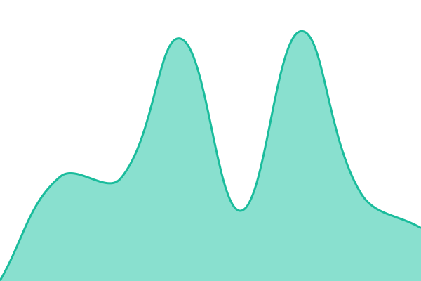 370ms
     
 | 

<a href="https://status.mask.io/history/rpc-server-x-dai">100.00%</a>
    

|  RPC server - Avalanche | 🟨 Degraded | [rpc-server-avalanche.yml](https://github.com/DimensionDev/status.mask.io/commits/HEAD/history/rpc-server-avalanche.yml) | 

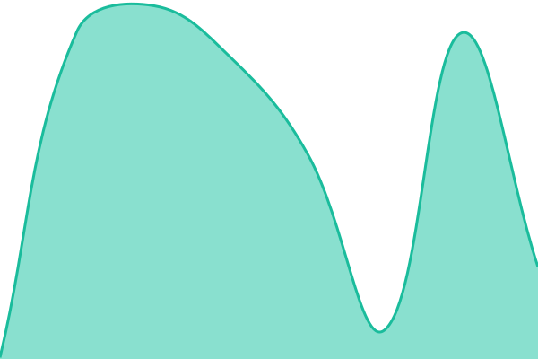 133ms
     
 | 

<a href="https://status.mask.io/history/rpc-server-avalanche">0.00%</a>
    

|  RPC server - Celo | 🟩 Up | [rpc-server-celo.yml](https://github.com/DimensionDev/status.mask.io/commits/HEAD/history/rpc-server-celo.yml) | 

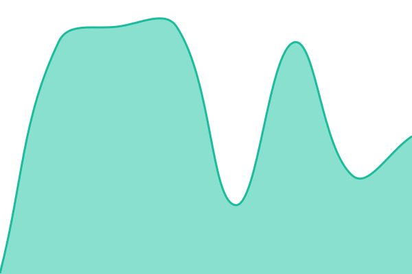 206ms
     
 | 

<a href="https://status.mask.io/history/rpc-server-celo">100.00%</a>
    

|  RPC server - Conflux | 🟩 Up | [rpc-server-conflux.yml](https://github.com/DimensionDev/status.mask.io/commits/HEAD/history/rpc-server-conflux.yml) | 

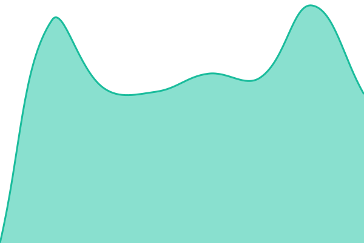 885ms
     
 | 

<a href="https://status.mask.io/history/rpc-server-conflux">100.00%</a>
    

|  RPC server - Harmony | 🟩 Up | [rpc-server-harmony.yml](https://github.com/DimensionDev/status.mask.io/commits/HEAD/history/rpc-server-harmony.yml) | 

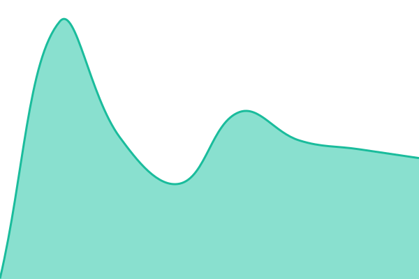 293ms
     
 | 

<a href="https://status.mask.io/history/rpc-server-harmony">100.00%</a>
    

|  RPC server - Astar | 🟩 Up | [rpc-server-astar.yml](https://github.com/DimensionDev/status.mask.io/commits/HEAD/history/rpc-server-astar.yml) | 

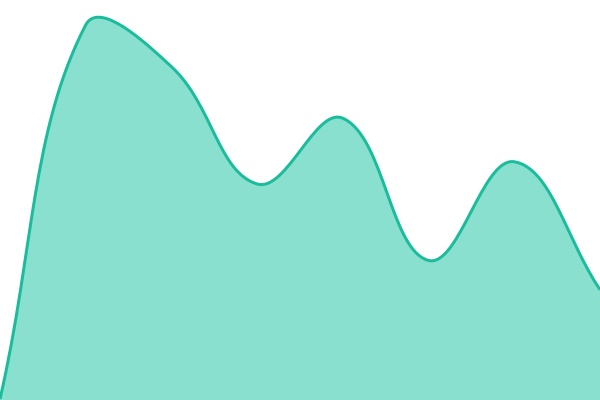 252ms
     
 | 

<a href="https://status.mask.io/history/rpc-server-astar">100.00%</a>
    

|  RPC server - Optimism | 🟨 Degraded | [rpc-server-optimism.yml](https://github.com/DimensionDev/status.mask.io/commits/HEAD/history/rpc-server-optimism.yml) | 

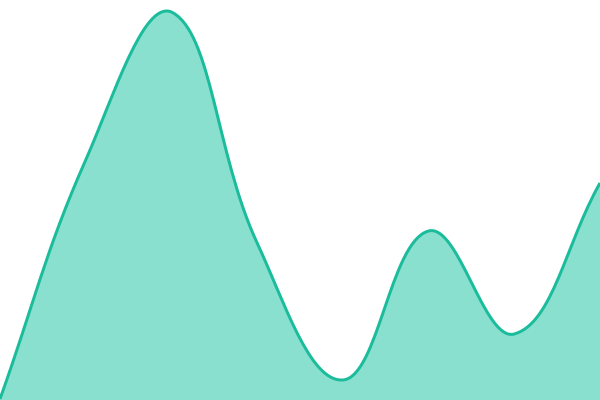 180ms
     
 | 

<a href="https://status.mask.io/history/rpc-server-optimism">0.00%</a>
    

|  API - Rabby Token | 🟩 Up | [api-rabby-token.yml](https://github.com/DimensionDev/status.mask.io/commits/HEAD/history/api-rabby-token.yml) | 

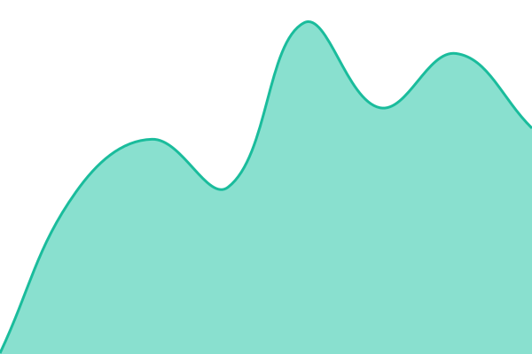 321ms
     
 | 

<a href="https://status.mask.io/history/api-rabby-token">100.00%</a>
    

|  API - Astar Gas Price | 🟩 Up | [api-astar-gas-price.yml](https://github.com/DimensionDev/status.mask.io/commits/HEAD/history/api-astar-gas-price.yml) | 

 375ms
     
 | 

<a href="https://status.mask.io/history/api-astar-gas-price">100.00%</a>
    

|  API - CoinMarketCap Trending Widget | 🟩 Up | [api-coin-market-cap-trending-widget.yml](https://github.com/DimensionDev/status.mask.io/commits/HEAD/history/api-coin-market-cap-trending-widget.yml) | 

 220ms
     
 | 

<a href="https://status.mask.io/history/api-coin-market-cap-trending-widget">100.00%</a>
    

|  API - CoinGecko Trending | 🟩 Up | [api-coin-gecko-trending.yml](https://github.com/DimensionDev/status.mask.io/commits/HEAD/history/api-coin-gecko-trending.yml) | 

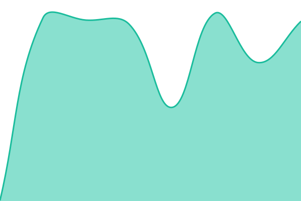 286ms
     
 | 

<a href="https://status.mask.io/history/api-coin-gecko-trending">100.00%</a>
    

|  API - Metaswap Gas Price | 🟩 Up | [api-metaswap-gas-price.yml](https://github.com/DimensionDev/status.mask.io/commits/HEAD/history/api-metaswap-gas-price.yml) | 

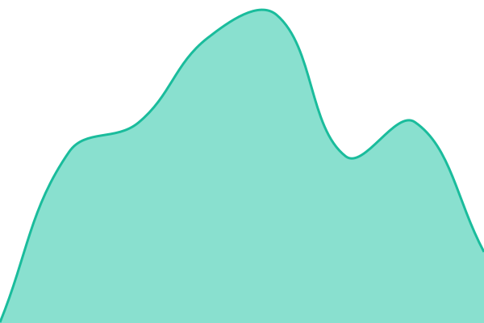 248ms
     
 | 

<a href="https://status.mask.io/history/api-metaswap-gas-price">100.00%</a>
    

|  Assets - Cloudflare Images | 🟩 Up | [assets-cloudflare-images.yml](https://github.com/DimensionDev/status.mask.io/commits/HEAD/history/assets-cloudflare-images.yml) | 

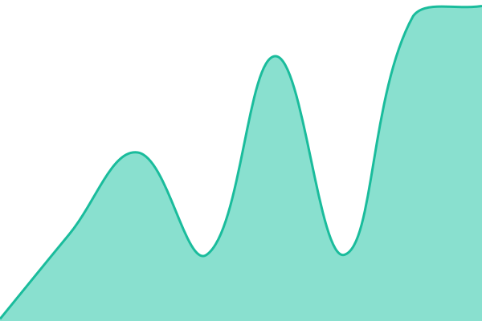 101ms
     
 | 

<a href="https://status.mask.io/history/assets-cloudflare-images">100.00%</a>
    

|  [Maskbook File Service Recovery](https://mask-fileservice-landingpage.pages.dev/recover) | 🟩 Up | [maskbook-file-service-recovery.yml](https://github.com/DimensionDev/status.mask.io/commits/HEAD/history/maskbook-file-service-recovery.yml) | 

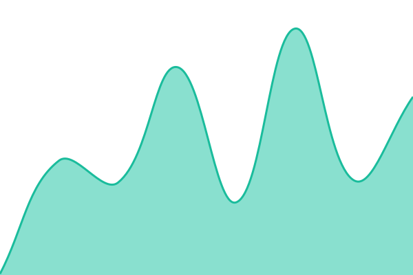 131ms
     
 | 

<a href="https://status.mask.io/history/maskbook-file-service-recovery">100.00%</a>
    

|  [Arweave](https://2uhlk62ro3ctby7mehzurppjwc7tjuezhzthbjabmm2v6jtrnsba.arweave.net/1Q61e1F2xTDj7CHzSL3psL800Jk-ZnCkAWM1XyZxbII#uxKdi0MDuxp7huif) | 🟩 Up | [arweave.yml](https://github.com/DimensionDev/status.mask.io/commits/HEAD/history/arweave.yml) | 

 566ms
     
 | 

<a href="https://status.mask.io/history/arweave">100.00%</a>
    

<!--end: status pages-->

[**Visit our status website →**](https://status.mask.io)

## 📄 License

- Powered by: [Upptime](https://github.com/upptime/upptime)
- Code: [MIT](./LICENSE) © [Dimension](https://dimension.im)
- Data in the `./history` directory: [Open Database License](https://opendatacommons.org/licenses/odbl/1-0/)
