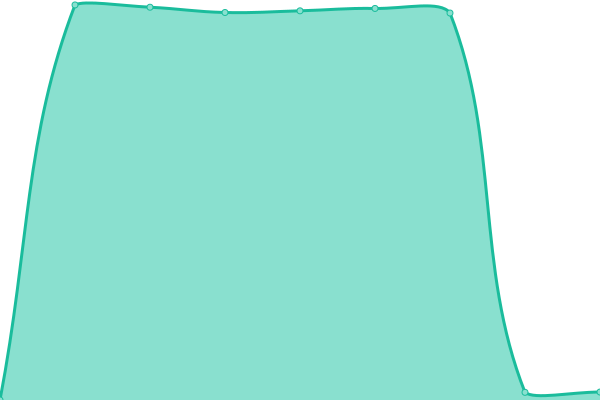
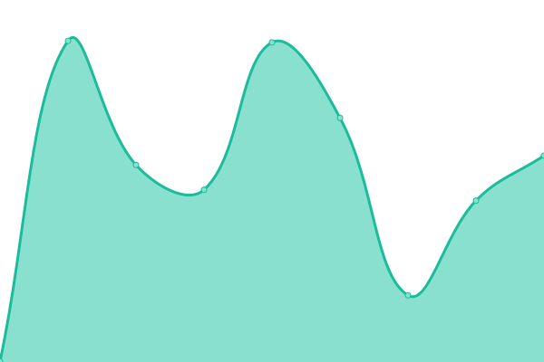
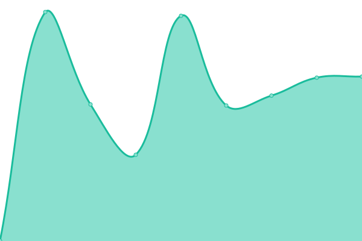
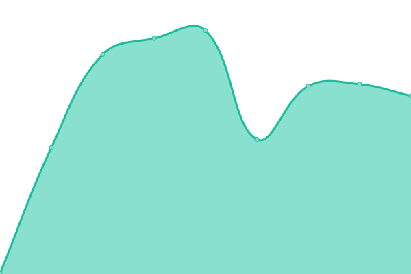
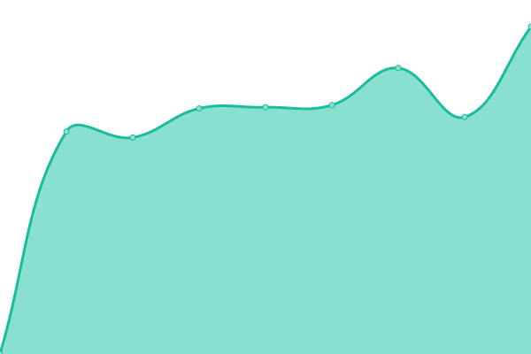
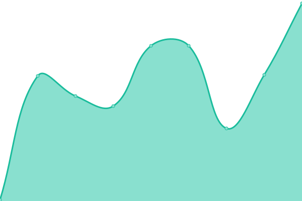

# [📈 Live Status](https://status.mask.io): <!--live status--> **🟧 Partial outage**

This repository contains the open-source uptime monitor and status page for [Dimension](https://dimension.im), powered by [Upptime](https://github.com/upptime/upptime).

With [Upptime](https://upptime.js.org), you can get your own unlimited and free uptime monitor and status page, powered entirely by a GitHub repository. We use [Issues](https://github.com/DimensionDev/status/issues) as incident reports, [Actions](https://github.com/DimensionDev/status/actions) as uptime monitors, and [Pages](https://status.mask.io) for the status page.

<!--start: status pages-->
<!-- This summary is generated by Upptime (https://github.com/upptime/upptime) -->
<!-- Do not edit this manually, your changes will be overwritten -->
<!-- prettier-ignore -->
| URL | Status | History | Response Time | Uptime |
| --- | ------ | ------- | ------------- | ------ |
|  [mask.io](https://mask.io) | 🟩 Up | [mask-io.yml](https://github.com/DimensionDev/status/commits/HEAD/history/mask-io.yml) | 

 142ms
     
 | 

<a href="https://status.mask.io/history/mask-io">100.00%</a>
    

|  [Maskbook UnlockProtocol plugin server](https://unlock.r2d2.to) | 🟩 Up | [maskbook-unlock-protocol-plugin-server.yml](https://github.com/DimensionDev/status/commits/HEAD/history/maskbook-unlock-protocol-plugin-server.yml) | 

 811ms
     
 | 

<a href="https://status.mask.io/history/maskbook-unlock-protocol-plugin-server">100.00%</a>
    

|  RPC server - Infura Mainnet | 🟩 Up | [rpc-server-infura-mainnet.yml](https://github.com/DimensionDev/status/commits/HEAD/history/rpc-server-infura-mainnet.yml) | 

 218ms
     
 | 

<a href="https://status.mask.io/history/rpc-server-infura-mainnet">100.00%</a>
    

|  RPC server - Quiknode Mainnet | 🟩 Up | [rpc-server-quiknode-mainnet.yml](https://github.com/DimensionDev/status/commits/HEAD/history/rpc-server-quiknode-mainnet.yml) | 

 66ms
     
 | 

<a href="https://status.mask.io/history/rpc-server-quiknode-mainnet">100.00%</a>
    

|  RPC server - Infura Ropsten | 🟨 Degraded | [rpc-server-infura-ropsten.yml](https://github.com/DimensionDev/status/commits/HEAD/history/rpc-server-infura-ropsten.yml) | 

 200ms
     
 | 

<a href="https://status.mask.io/history/rpc-server-infura-ropsten">100.00%</a>
    

|  RPC server - Infura Rinkeby | 🟨 Degraded | [rpc-server-infura-rinkeby.yml](https://github.com/DimensionDev/status/commits/HEAD/history/rpc-server-infura-rinkeby.yml) | 

 188ms
     
 | 

<a href="https://status.mask.io/history/rpc-server-infura-rinkeby">100.00%</a>
    

|  RPC server - Infura Kovan | 🟨 Degraded | [rpc-server-infura-kovan.yml](https://github.com/DimensionDev/status/commits/HEAD/history/rpc-server-infura-kovan.yml) | 

 200ms
     
 | 

<a href="https://status.mask.io/history/rpc-server-infura-kovan">100.00%</a>
    

|  RPC server - Infura Gorli | 🟩 Up | [rpc-server-infura-gorli.yml](https://github.com/DimensionDev/status/commits/HEAD/history/rpc-server-infura-gorli.yml) | 

 205ms
     
 | 

<a href="https://status.mask.io/history/rpc-server-infura-gorli">100.00%</a>
    

|  RPC server - Binance BSC | 🟩 Up | [rpc-server-binance-bsc.yml](https://github.com/DimensionDev/status/commits/HEAD/history/rpc-server-binance-bsc.yml) | 

 460ms
     
 | 

<a href="https://status.mask.io/history/rpc-server-binance-bsc">100.00%</a>
    

|  RPC server - Binance BSCT | 🟩 Up | [rpc-server-binance-bsct.yml](https://github.com/DimensionDev/status/commits/HEAD/history/rpc-server-binance-bsct.yml) | 

 7438ms
     
 | 

<a href="https://status.mask.io/history/rpc-server-binance-bsct">73.96%</a>
    

|  RPC server - Infura Matic Mainnet | 🟩 Up | [rpc-server-infura-matic-mainnet.yml](https://github.com/DimensionDev/status/commits/HEAD/history/rpc-server-infura-matic-mainnet.yml) | 

 179ms
     
 | 

<a href="https://status.mask.io/history/rpc-server-infura-matic-mainnet">100.00%</a>
    

|  RPC server - Infura Matic Mumbai | 🟩 Up | [rpc-server-infura-matic-mumbai.yml](https://github.com/DimensionDev/status/commits/HEAD/history/rpc-server-infura-matic-mumbai.yml) | 

 189ms
     
 | 

<a href="https://status.mask.io/history/rpc-server-infura-matic-mumbai">100.00%</a>
    

|  RPC server - Arbitrum | 🟩 Up | [rpc-server-arbitrum.yml](https://github.com/DimensionDev/status/commits/HEAD/history/rpc-server-arbitrum.yml) | 

 198ms
     
 | 

<a href="https://status.mask.io/history/rpc-server-arbitrum">99.86%</a>
    

|  RPC server - Arbitrum Rinkeby | 🟩 Up | [rpc-server-arbitrum-rinkeby.yml](https://github.com/DimensionDev/status/commits/HEAD/history/rpc-server-arbitrum-rinkeby.yml) | 

 163ms
     
 | 

<a href="https://status.mask.io/history/rpc-server-arbitrum-rinkeby">100.00%</a>
    

|  RPC server - xDai | 🟩 Up | [rpc-server-x-dai.yml](https://github.com/DimensionDev/status/commits/HEAD/history/rpc-server-x-dai.yml) | 

 292ms
     
 | 

<a href="https://status.mask.io/history/rpc-server-x-dai">100.00%</a>
    

|  RPC server - Avalanche | 🟩 Up | [rpc-server-avalanche.yml](https://github.com/DimensionDev/status/commits/HEAD/history/rpc-server-avalanche.yml) | 

 78ms
     
 | 

<a href="https://status.mask.io/history/rpc-server-avalanche">100.00%</a>
    

|  RPC server - Avalanche Fuji | 🟩 Up | [rpc-server-avalanche-fuji.yml](https://github.com/DimensionDev/status/commits/HEAD/history/rpc-server-avalanche-fuji.yml) | 

 93ms
     
 | 

<a href="https://status.mask.io/history/rpc-server-avalanche-fuji">100.00%</a>
    

|  RPC server - Celo | 🟩 Up | [rpc-server-celo.yml](https://github.com/DimensionDev/status/commits/HEAD/history/rpc-server-celo.yml) | 

 204ms
     
 | 

<a href="https://status.mask.io/history/rpc-server-celo">100.00%</a>
    

|  RPC server - Fantom | 🟩 Up | [rpc-server-fantom.yml](https://github.com/DimensionDev/status/commits/HEAD/history/rpc-server-fantom.yml) | 

 349ms
     
 | 

<a href="https://status.mask.io/history/rpc-server-fantom">100.00%</a>
    

|  RPC server - Aurora | 🟩 Up | [rpc-server-aurora.yml](https://github.com/DimensionDev/status/commits/HEAD/history/rpc-server-aurora.yml) | 

 111ms
     
 | 

<a href="https://status.mask.io/history/rpc-server-aurora">100.00%</a>
    

|  RPC server - Aurora Testnet | 🟩 Up | [rpc-server-aurora-testnet.yml](https://github.com/DimensionDev/status/commits/HEAD/history/rpc-server-aurora-testnet.yml) | 

 123ms
     
 | 

<a href="https://status.mask.io/history/rpc-server-aurora-testnet">100.00%</a>
    

|  RPC server - Conflux | 🟩 Up | [rpc-server-conflux.yml](https://github.com/DimensionDev/status/commits/HEAD/history/rpc-server-conflux.yml) | 

 1014ms
     
 | 

<a href="https://status.mask.io/history/rpc-server-conflux">100.00%</a>
    

|  RPC server - Harmony | 🟩 Up | [rpc-server-harmony.yml](https://github.com/DimensionDev/status/commits/HEAD/history/rpc-server-harmony.yml) | 

 326ms
     
 | 

<a href="https://status.mask.io/history/rpc-server-harmony">100.00%</a>
    

|  RPC server - Harmony Test | 🟩 Up | [rpc-server-harmony-test.yml](https://github.com/DimensionDev/status/commits/HEAD/history/rpc-server-harmony-test.yml) | 

 1000ms
     
 | 

<a href="https://status.mask.io/history/rpc-server-harmony-test">99.91%</a>
    

|  RPC server - Astar | 🟩 Up | [rpc-server-astar.yml](https://github.com/DimensionDev/status/commits/HEAD/history/rpc-server-astar.yml) | 

 494ms
     
 | 

<a href="https://status.mask.io/history/rpc-server-astar">100.00%</a>
    

|  RPC server - Figment Solana | 🟨 Degraded | [rpc-server-figment-solana.yml](https://github.com/DimensionDev/status/commits/HEAD/history/rpc-server-figment-solana.yml) | 

 353ms
     
 | 

<a href="https://status.mask.io/history/rpc-server-figment-solana">0.00%</a>
    

|  API - Rabby Token | 🟩 Up | [api-rabby-token.yml](https://github.com/DimensionDev/status/commits/HEAD/history/api-rabby-token.yml) | 

 598ms
     
 | 

<a href="https://status.mask.io/history/api-rabby-token">100.00%</a>
    

|  API - Alchemy EVM NFT | 🟩 Up | [api-alchemy-evm-nft.yml](https://github.com/DimensionDev/status/commits/HEAD/history/api-alchemy-evm-nft.yml) | 

 172ms
     
 | 

<a href="https://status.mask.io/history/api-alchemy-evm-nft">93.77%</a>
    

|  API - Astar Gas Price | 🟩 Up | [api-astar-gas-price.yml](https://github.com/DimensionDev/status/commits/HEAD/history/api-astar-gas-price.yml) | 

 361ms
     
 | 

<a href="https://status.mask.io/history/api-astar-gas-price">100.00%</a>
    

|  API - Chainbase NFT | 🟩 Up | [api-chainbase-nft.yml](https://github.com/DimensionDev/status/commits/HEAD/history/api-chainbase-nft.yml) | 

 185ms
     
 | 

<a href="https://status.mask.io/history/api-chainbase-nft">38.46%</a>
    

|  API - CoinMarketCap Trending Widget | 🟩 Up | [api-coin-market-cap-trending-widget.yml](https://github.com/DimensionDev/status/commits/HEAD/history/api-coin-market-cap-trending-widget.yml) | 

 295ms
     
 | 

<a href="https://status.mask.io/history/api-coin-market-cap-trending-widget">100.00%</a>
    

|  API - CoinMarketCap Trending | 🟩 Up | [api-coin-market-cap-trending.yml](https://github.com/DimensionDev/status/commits/HEAD/history/api-coin-market-cap-trending.yml) | 

 341ms
     
 | 

<a href="https://status.mask.io/history/api-coin-market-cap-trending">100.00%</a>
    

|  API - CoinGecko Trending | 🟩 Up | [api-coin-gecko-trending.yml](https://github.com/DimensionDev/status/commits/HEAD/history/api-coin-gecko-trending.yml) | 

 359ms
     
 | 

<a href="https://status.mask.io/history/api-coin-gecko-trending">100.00%</a>
    

|  API - Debank Gas Price Dict | 🟩 Up | [api-debank-gas-price-dict.yml](https://github.com/DimensionDev/status/commits/HEAD/history/api-debank-gas-price-dict.yml) | 

 261ms
     
 | 

<a href="https://status.mask.io/history/api-debank-gas-price-dict">100.00%</a>
    

|  API - Debank NFT | 🟩 Up | [api-debank-nft.yml](https://github.com/DimensionDev/status/commits/HEAD/history/api-debank-nft.yml) | 

 757ms
     
 | 

<a href="https://status.mask.io/history/api-debank-nft">100.00%</a>
    

|  API - Gem NFT | 🟥 Down | [api-gem-nft.yml](https://github.com/DimensionDev/status/commits/HEAD/history/api-gem-nft.yml) | 

 433ms
     
 | 

<a href="https://status.mask.io/history/api-gem-nft">0.00%</a>
    

|  API - Gopluslabs Security | 🟩 Up | [api-gopluslabs-security.yml](https://github.com/DimensionDev/status/commits/HEAD/history/api-gopluslabs-security.yml) | 

 556ms
     
 | 

<a href="https://status.mask.io/history/api-gopluslabs-security">100.00%</a>
    

|  API - Looksrare NFT | 🟩 Up | [api-looksrare-nft.yml](https://github.com/DimensionDev/status/commits/HEAD/history/api-looksrare-nft.yml) | 

 286ms
     
 | 

<a href="https://status.mask.io/history/api-looksrare-nft">100.00%</a>
    

|  API - Metaswap Gas Price | 🟩 Up | [api-metaswap-gas-price.yml](https://github.com/DimensionDev/status/commits/HEAD/history/api-metaswap-gas-price.yml) | 

 165ms
     
 | 

<a href="https://status.mask.io/history/api-metaswap-gas-price">100.00%</a>
    

|  API - Minds SNS | 🟩 Up | [api-minds-sns.yml](https://github.com/DimensionDev/status/commits/HEAD/history/api-minds-sns.yml) | 

 214ms
     
 | 

<a href="https://status.mask.io/history/api-minds-sns">100.00%</a>
    

|  API - NFTScan EVM NFT | 🟩 Up | [api-nft-scan-evm-nft.yml](https://github.com/DimensionDev/status/commits/HEAD/history/api-nft-scan-evm-nft.yml) | 

 1196ms
     
 | 

<a href="https://status.mask.io/history/api-nft-scan-evm-nft">100.00%</a>
    

|  API - NFTScan Solana NFT | 🟩 Up | [api-nft-scan-solana-nft.yml](https://github.com/DimensionDev/status/commits/HEAD/history/api-nft-scan-solana-nft.yml) | 

 543ms
     
 | 

<a href="https://status.mask.io/history/api-nft-scan-solana-nft">100.00%</a>
    

|  API - NFTScan Trending | 🟩 Up | [api-nft-scan-trending.yml](https://github.com/DimensionDev/status/commits/HEAD/history/api-nft-scan-trending.yml) | 

 586ms
     
 | 

<a href="https://status.mask.io/history/api-nft-scan-trending">99.17%</a>
    

|  API - Opensea NFT | 🟩 Up | [api-opensea-nft.yml](https://github.com/DimensionDev/status/commits/HEAD/history/api-opensea-nft.yml) | 

 595ms
     
 | 

<a href="https://status.mask.io/history/api-opensea-nft">82.76%</a>
    

|  API - NFTScan Trending | 🟩 Up | [api-nft-scan-trending.yml](https://github.com/DimensionDev/status/commits/HEAD/history/api-nft-scan-trending.yml) | 

 586ms
     
 | 

<a href="https://status.mask.io/history/api-nft-scan-trending">99.17%</a>
    

|  API - Rabby NFT | 🟩 Up | [api-rabby-nft.yml](https://github.com/DimensionDev/status/commits/HEAD/history/api-rabby-nft.yml) | 

 570ms
     
 | 

<a href="https://status.mask.io/history/api-rabby-nft">100.00%</a>
    

|  API - Rarible NFT | 🟩 Up | [api-rarible-nft.yml](https://github.com/DimensionDev/status/commits/HEAD/history/api-rarible-nft.yml) | 

 411ms
     
 | 

<a href="https://status.mask.io/history/api-rarible-nft">100.00%</a>
    

|  API - X2Y2 NFT | 🟩 Up | [api-x2-y2-nft.yml](https://github.com/DimensionDev/status/commits/HEAD/history/api-x2-y2-nft.yml) | 

 983ms
     
 | 

<a href="https://status.mask.io/history/api-x2-y2-nft">100.00%</a>
    

|  API - Zora NFT | 🟩 Up | [api-zora-nft.yml](https://github.com/DimensionDev/status/commits/HEAD/history/api-zora-nft.yml) | 

 237ms
     
 | 

<a href="https://status.mask.io/history/api-zora-nft">100.00%</a>
    

|  API - Twitter Identity | 🟩 Up | [api-twitter-identity.yml](https://github.com/DimensionDev/status/commits/HEAD/history/api-twitter-identity.yml) | 

 1229ms
     
 | 

<a href="https://status.mask.io/history/api-twitter-identity">87.70%</a>
    

|  Assets - Cloudflare Images | 🟩 Up | [assets-cloudflare-images.yml](https://github.com/DimensionDev/status/commits/HEAD/history/assets-cloudflare-images.yml) | 

 100ms
     
 | 

<a href="https://status.mask.io/history/assets-cloudflare-images">100.00%</a>
    

<!--end: status pages-->

[**Visit our status website →**](https://status.mask.io)

## 📄 License

- Powered by: [Upptime](https://github.com/upptime/upptime)
- Code: [MIT](./LICENSE) © [Dimension](https://dimension.im)
- Data in the `./history` directory: [Open Database License](https://opendatacommons.org/licenses/odbl/1-0/)
