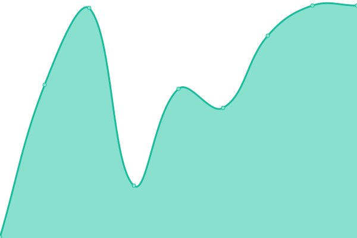

# [📈 Live Status](https://status.mask.io): <!--live status--> **🟨 Degraded performance**

This repository contains the open-source uptime monitor and status page for [Dimension](https://dimension.im), powered by [Upptime](https://github.com/upptime/upptime).

With [Upptime](https://upptime.js.org), you can get your own unlimited and free uptime monitor and status page, powered entirely by a GitHub repository. We use [Issues](https://github.com/DimensionDev/status/issues) as incident reports, [Actions](https://github.com/DimensionDev/status/actions) as uptime monitors, and [Pages](https://status.mask.io) for the status page.

<!--start: status pages-->
<!-- This summary is generated by Upptime (https://github.com/upptime/upptime) -->
<!-- Do not edit this manually, your changes will be overwritten -->
<!-- prettier-ignore -->
| URL | Status | History | Response Time | Uptime |
| --- | ------ | ------- | ------------- | ------ |
|  [mask.io](https://mask.io) | 🟩 Up | [mask-io.yml](https://github.com/DimensionDev/status/commits/HEAD/history/mask-io.yml) | 

 184ms
     
 | 

<a href="https://status.mask.io/history/mask-io">100.00%</a>
    

|  [Maskbook UnlockProtocol plugin server](https://unlock.r2d2.to) | 🟩 Up | [maskbook-unlock-protocol-plugin-server.yml](https://github.com/DimensionDev/status/commits/HEAD/history/maskbook-unlock-protocol-plugin-server.yml) | 

 855ms
     
 | 

<a href="https://status.mask.io/history/maskbook-unlock-protocol-plugin-server">100.00%</a>
    

|  RPC server - Infura Mainnet | 🟩 Up | [rpc-server-infura-mainnet.yml](https://github.com/DimensionDev/status/commits/HEAD/history/rpc-server-infura-mainnet.yml) | 

 235ms
     
 | 

<a href="https://status.mask.io/history/rpc-server-infura-mainnet">100.00%</a>
    

|  RPC server - Quiknode Mainnet | 🟩 Up | [rpc-server-quiknode-mainnet.yml](https://github.com/DimensionDev/status/commits/HEAD/history/rpc-server-quiknode-mainnet.yml) | 

 103ms
     
 | 

<a href="https://status.mask.io/history/rpc-server-quiknode-mainnet">100.00%</a>
    

|  RPC server - Infura Ropsten | 🟨 Degraded | [rpc-server-infura-ropsten.yml](https://github.com/DimensionDev/status/commits/HEAD/history/rpc-server-infura-ropsten.yml) | 

 811ms
     
 | 

<a href="https://status.mask.io/history/rpc-server-infura-ropsten">48.24%</a>
    

|  RPC server - Infura Rinkeby | 🟨 Degraded | [rpc-server-infura-rinkeby.yml](https://github.com/DimensionDev/status/commits/HEAD/history/rpc-server-infura-rinkeby.yml) | 

 198ms
     
 | 

<a href="https://status.mask.io/history/rpc-server-infura-rinkeby">48.24%</a>
    

|  RPC server - Infura Kovan | 🟨 Degraded | [rpc-server-infura-kovan.yml](https://github.com/DimensionDev/status/commits/HEAD/history/rpc-server-infura-kovan.yml) | 

 193ms
     
 | 

<a href="https://status.mask.io/history/rpc-server-infura-kovan">48.24%</a>
    

|  RPC server - Infura Gorli | 🟩 Up | [rpc-server-infura-gorli.yml](https://github.com/DimensionDev/status/commits/HEAD/history/rpc-server-infura-gorli.yml) | 

 226ms
     
 | 

<a href="https://status.mask.io/history/rpc-server-infura-gorli">100.00%</a>
    

|  RPC server - Binance BSC | 🟩 Up | [rpc-server-binance-bsc.yml](https://github.com/DimensionDev/status/commits/HEAD/history/rpc-server-binance-bsc.yml) | 

 323ms
     
 | 

<a href="https://status.mask.io/history/rpc-server-binance-bsc">100.00%</a>
    

|  RPC server - Binance BSCT | 🟩 Up | [rpc-server-binance-bsct.yml](https://github.com/DimensionDev/status/commits/HEAD/history/rpc-server-binance-bsct.yml) | 

 641ms
     
 | 

<a href="https://status.mask.io/history/rpc-server-binance-bsct">100.00%</a>
    

|  RPC server - Infura Matic Mainnet | 🟩 Up | [rpc-server-infura-matic-mainnet.yml](https://github.com/DimensionDev/status/commits/HEAD/history/rpc-server-infura-matic-mainnet.yml) | 

 179ms
     
 | 

<a href="https://status.mask.io/history/rpc-server-infura-matic-mainnet">100.00%</a>
    

|  RPC server - Infura Matic Mumbai | 🟩 Up | [rpc-server-infura-matic-mumbai.yml](https://github.com/DimensionDev/status/commits/HEAD/history/rpc-server-infura-matic-mumbai.yml) | 

 176ms
     
 | 

<a href="https://status.mask.io/history/rpc-server-infura-matic-mumbai">100.00%</a>
    

|  RPC server - Arbitrum | 🟩 Up | [rpc-server-arbitrum.yml](https://github.com/DimensionDev/status/commits/HEAD/history/rpc-server-arbitrum.yml) | 

 148ms
     
 | 

<a href="https://status.mask.io/history/rpc-server-arbitrum">100.00%</a>
    

|  RPC server - Arbitrum Rinkeby | 🟩 Up | [rpc-server-arbitrum-rinkeby.yml](https://github.com/DimensionDev/status/commits/HEAD/history/rpc-server-arbitrum-rinkeby.yml) | 

 196ms
     
 | 

<a href="https://status.mask.io/history/rpc-server-arbitrum-rinkeby">100.00%</a>
    

|  RPC server - xDai | 🟩 Up | [rpc-server-x-dai.yml](https://github.com/DimensionDev/status/commits/HEAD/history/rpc-server-x-dai.yml) | 

 241ms
     
 | 

<a href="https://status.mask.io/history/rpc-server-x-dai">100.00%</a>
    

|  RPC server - Avalanche | 🟩 Up | [rpc-server-avalanche.yml](https://github.com/DimensionDev/status/commits/HEAD/history/rpc-server-avalanche.yml) | 

 81ms
     
 | 

<a href="https://status.mask.io/history/rpc-server-avalanche">100.00%</a>
    

|  RPC server - Avalanche Fuji | 🟩 Up | [rpc-server-avalanche-fuji.yml](https://github.com/DimensionDev/status/commits/HEAD/history/rpc-server-avalanche-fuji.yml) | 

 120ms
     
 | 

<a href="https://status.mask.io/history/rpc-server-avalanche-fuji">100.00%</a>
    

|  RPC server - Celo | 🟩 Up | [rpc-server-celo.yml](https://github.com/DimensionDev/status/commits/HEAD/history/rpc-server-celo.yml) | 

 186ms
     
 | 

<a href="https://status.mask.io/history/rpc-server-celo">100.00%</a>
    

|  RPC server - Fantom | 🟩 Up | [rpc-server-fantom.yml](https://github.com/DimensionDev/status/commits/HEAD/history/rpc-server-fantom.yml) | 

 349ms
     
 | 

<a href="https://status.mask.io/history/rpc-server-fantom">100.00%</a>
    

|  RPC server - Aurora | 🟩 Up | [rpc-server-aurora.yml](https://github.com/DimensionDev/status/commits/HEAD/history/rpc-server-aurora.yml) | 

 118ms
     
 | 

<a href="https://status.mask.io/history/rpc-server-aurora">100.00%</a>
    

|  RPC server - Aurora Testnet | 🟩 Up | [rpc-server-aurora-testnet.yml](https://github.com/DimensionDev/status/commits/HEAD/history/rpc-server-aurora-testnet.yml) | 

 114ms
     
 | 

<a href="https://status.mask.io/history/rpc-server-aurora-testnet">100.00%</a>
    

|  RPC server - Conflux | 🟩 Up | [rpc-server-conflux.yml](https://github.com/DimensionDev/status/commits/HEAD/history/rpc-server-conflux.yml) | 

 1611ms
     
 | 

<a href="https://status.mask.io/history/rpc-server-conflux">100.00%</a>
    

|  RPC server - Harmony | 🟩 Up | [rpc-server-harmony.yml](https://github.com/DimensionDev/status/commits/HEAD/history/rpc-server-harmony.yml) | 

 370ms
     
 | 

<a href="https://status.mask.io/history/rpc-server-harmony">100.00%</a>
    

|  RPC server - Harmony Test | 🟩 Up | [rpc-server-harmony-test.yml](https://github.com/DimensionDev/status/commits/HEAD/history/rpc-server-harmony-test.yml) | 

 684ms
     
 | 

<a href="https://status.mask.io/history/rpc-server-harmony-test">100.00%</a>
    

|  RPC server - Astar | 🟩 Up | [rpc-server-astar.yml](https://github.com/DimensionDev/status/commits/HEAD/history/rpc-server-astar.yml) | 

 480ms
     
 | 

<a href="https://status.mask.io/history/rpc-server-astar">100.00%</a>
    

|  RPC server - Figment Solana | 🟩 Up | [rpc-server-figment-solana.yml](https://github.com/DimensionDev/status/commits/HEAD/history/rpc-server-figment-solana.yml) | 

 316ms
     
 | 

<a href="https://status.mask.io/history/rpc-server-figment-solana">100.00%</a>
    

|  API - Rabby Token | 🟩 Up | [api-rabby-token.yml](https://github.com/DimensionDev/status/commits/HEAD/history/api-rabby-token.yml) | 

 880ms
     
 | 

<a href="https://status.mask.io/history/api-rabby-token">99.53%</a>
    

|  API - Rabby NFT | 🟩 Up | [api-rabby-nft.yml](https://github.com/DimensionDev/status/commits/HEAD/history/api-rabby-nft.yml) | 

 502ms
     
 | 

<a href="https://status.mask.io/history/api-rabby-nft">99.13%</a>
    

|  NFT - Alchemy EVM | 🟩 Up | [nft-alchemy-evm.yml](https://github.com/DimensionDev/status/commits/HEAD/history/nft-alchemy-evm.yml) | 

 0ms
     
 | 

<a href="https://status.mask.io/history/nft-alchemy-evm">0.42%</a>
    

|  NFT - Alchemy Flow | 🟩 Up | [nft-alchemy-flow.yml](https://github.com/DimensionDev/status/commits/HEAD/history/nft-alchemy-flow.yml) | 

 0ms
     
 | 

<a href="https://status.mask.io/history/nft-alchemy-flow">0.36%</a>
    

|  GasPrice - Astar | 🟩 Up | [gas-price-astar.yml](https://github.com/DimensionDev/status/commits/HEAD/history/gas-price-astar.yml) | 

 0ms
     
 | 

<a href="https://status.mask.io/history/gas-price-astar">0.31%</a>
    

|  Asset - Cloudflare | 🟩 Up | [asset-cloudflare.yml](https://github.com/DimensionDev/status/commits/HEAD/history/asset-cloudflare.yml) | 

 0ms
     
 | 

<a href="https://status.mask.io/history/asset-cloudflare">0.28%</a>
    

|  NFT - Chainbase | 🟩 Up | [nft-chainbase.yml](https://github.com/DimensionDev/status/commits/HEAD/history/nft-chainbase.yml) | 

 0ms
     
 | 

<a href="https://status.mask.io/history/nft-chainbase">0.21%</a>
    

|  Trending - CoinMarketCap Widge | 🟩 Up | [trending-coin-market-cap-widge.yml](https://github.com/DimensionDev/status/commits/HEAD/history/trending-coin-market-cap-widge.yml) | 

 0ms
     
 | 

<a href="https://status.mask.io/history/trending-coin-market-cap-widge">0.19%</a>
    

|  Trending - CoinMarketCap | 🟩 Up | [trending-coin-market-cap.yml](https://github.com/DimensionDev/status/commits/HEAD/history/trending-coin-market-cap.yml) | 

 0ms
     
 | 

<a href="https://status.mask.io/history/trending-coin-market-cap">0.12%</a>
    

|  Trending - CoinGecko | 🟩 Up | [trending-coin-gecko.yml](https://github.com/DimensionDev/status/commits/HEAD/history/trending-coin-gecko.yml) | 

 0ms
     
 | 

<a href="https://status.mask.io/history/trending-coin-gecko">0.54%</a>
    

|  [GasPrice - Debank](Debank_Gas_Price_Dict_URL) | 🟩 Up | [gas-price-debank.yml](https://github.com/DimensionDev/status/commits/HEAD/history/gas-price-debank.yml) | 

 0ms
     
 | 

<a href="https://status.mask.io/history/gas-price-debank">0.54%</a>
    

|  NFT - Debank | 🟩 Up | [nft-debank.yml](https://github.com/DimensionDev/status/commits/HEAD/history/nft-debank.yml) | 

 0ms
     
 | 

<a href="https://status.mask.io/history/nft-debank">0.41%</a>
    

|  NFT - Gem | 🟩 Up | [nft-gem.yml](https://github.com/DimensionDev/status/commits/HEAD/history/nft-gem.yml) | 

 0ms
     
 | 

<a href="https://status.mask.io/history/nft-gem">0.34%</a>
    

|  Security - Gopluslabs | 🟩 Up | [security-gopluslabs.yml](https://github.com/DimensionDev/status/commits/HEAD/history/security-gopluslabs.yml) | 

 0ms
     
 | 

<a href="https://status.mask.io/history/security-gopluslabs">0.28%</a>
    

|  NFT - LooksRare | 🟩 Up | [nft-looks-rare.yml](https://github.com/DimensionDev/status/commits/HEAD/history/nft-looks-rare.yml) | 

 0ms
     
 | 

<a href="https://status.mask.io/history/nft-looks-rare">0.23%</a>
    

|  NFT - MagicEden | 🟩 Up | [nft-magic-eden.yml](https://github.com/DimensionDev/status/commits/HEAD/history/nft-magic-eden.yml) | 

 0ms
     
 | 

<a href="https://status.mask.io/history/nft-magic-eden">0.15%</a>
    

|  GasPrice - Metaswap | 🟩 Up | [gas-price-metaswap.yml](https://github.com/DimensionDev/status/commits/HEAD/history/gas-price-metaswap.yml) | 

 0ms
     
 | 

<a href="https://status.mask.io/history/gas-price-metaswap">0.07%</a>
    

|  SNS - Minds | 🟩 Up | [sns-minds.yml](https://github.com/DimensionDev/status/commits/HEAD/history/sns-minds.yml) | 

 0ms
     
 | 

<a href="https://status.mask.io/history/sns-minds">1.15%</a>
    

|  NFT - NFscan EVM | 🟩 Up | [nft-n-fscan-evm.yml](https://github.com/DimensionDev/status/commits/HEAD/history/nft-n-fscan-evm.yml) | 

 0ms
     
 | 

<a href="https://status.mask.io/history/nft-n-fscan-evm">0.49%</a>
    

|  NFT - NFTscan Solana | 🟩 Up | [nft-nf-tscan-solana.yml](https://github.com/DimensionDev/status/commits/HEAD/history/nft-nf-tscan-solana.yml) | 

 0ms
     
 | 

<a href="https://status.mask.io/history/nft-nf-tscan-solana">0.37%</a>
    

|  Trending - NFTScan | 🟩 Up | [trending-nft-scan.yml](https://github.com/DimensionDev/status/commits/HEAD/history/trending-nft-scan.yml) | 

 0ms
     
 | 

<a href="https://status.mask.io/history/trending-nft-scan">0.34%</a>
    

|  NFT - Opensea | 🟩 Up | [nft-opensea.yml](https://github.com/DimensionDev/status/commits/HEAD/history/nft-opensea.yml) | 

 0ms
     
 | 

<a href="https://status.mask.io/history/nft-opensea">0.23%</a>
    

|  NFT - Rabby | 🟩 Up | [nft-rabby.yml](https://github.com/DimensionDev/status/commits/HEAD/history/nft-rabby.yml) | 

 0ms
     
 | 

<a href="https://status.mask.io/history/nft-rabby">0.76%</a>
    

|  NFT - Rarible | 🟩 Up | [nft-rarible.yml](https://github.com/DimensionDev/status/commits/HEAD/history/nft-rarible.yml) | 

 0ms
     
 | 

<a href="https://status.mask.io/history/nft-rarible">0.05%</a>
    

|  Pricing - Token View | 🟩 Up | [pricing-token-view.yml](https://github.com/DimensionDev/status/commits/HEAD/history/pricing-token-view.yml) | 

 0ms
     
 | 

<a href="https://status.mask.io/history/pricing-token-view">0.60%</a>
    

|  NFT - X2Y2 | 🟩 Up | [nft-x2-y2.yml](https://github.com/DimensionDev/status/commits/HEAD/history/nft-x2-y2.yml) | 

 0ms
     
 | 

<a href="https://status.mask.io/history/nft-x2-y2">0.52%</a>
    

|  NFT - Zora | 🟩 Up | [nft-zora.yml](https://github.com/DimensionDev/status/commits/HEAD/history/nft-zora.yml) | 

 0ms
     
 | 

<a href="https://status.mask.io/history/nft-zora">0.38%</a>
    

<!--end: status pages-->

[**Visit our status website →**](https://status.mask.io)

## 📄 License

- Powered by: [Upptime](https://github.com/upptime/upptime)
- Code: [MIT](./LICENSE) © [Dimension](https://dimension.im)
- Data in the `./history` directory: [Open Database License](https://opendatacommons.org/licenses/odbl/1-0/)
